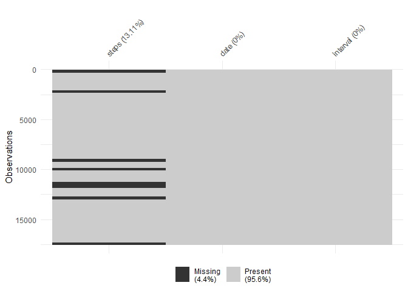

Project 1 - Reproducible Research
================
Cesar Benjumea
May 14, 2020

Packages and Session Info

``` r
library(ggplot2)
library(dplyr)
```

    ## 
    ## Attaching package: 'dplyr'

    ## The following objects are masked from 'package:stats':
    ## 
    ##     filter, lag

    ## The following objects are masked from 'package:base':
    ## 
    ##     intersect, setdiff, setequal, union

``` r
library(naniar)
library(mice)
```

    ## 
    ## Attaching package: 'mice'

    ## The following objects are masked from 'package:base':
    ## 
    ##     cbind, rbind

``` r
sessionInfo()
```

    ## R version 3.6.3 (2020-02-29)
    ## Platform: x86_64-w64-mingw32/x64 (64-bit)
    ## Running under: Windows 8.1 x64 (build 9600)
    ## 
    ## Matrix products: default
    ## 
    ## locale:
    ## [1] LC_COLLATE=Spanish_Colombia.1252  LC_CTYPE=Spanish_Colombia.1252   
    ## [3] LC_MONETARY=Spanish_Colombia.1252 LC_NUMERIC=C                     
    ## [5] LC_TIME=Spanish_Colombia.1252    
    ## 
    ## attached base packages:
    ## [1] stats     graphics  grDevices utils     datasets  methods   base     
    ## 
    ## other attached packages:
    ## [1] mice_3.8.0    naniar_0.5.1  dplyr_0.8.5   ggplot2_3.3.0
    ## 
    ## loaded via a namespace (and not attached):
    ##  [1] Rcpp_1.0.4.6     compiler_3.6.3   pillar_1.4.3     tools_3.6.3     
    ##  [5] digest_0.6.25    lattice_0.20-38  nlme_3.1-144     evaluate_0.14   
    ##  [9] lifecycle_0.2.0  tibble_3.0.0     gtable_0.3.0     pkgconfig_2.0.3 
    ## [13] rlang_0.4.5      cli_2.0.2        yaml_2.2.1       xfun_0.13       
    ## [17] withr_2.2.0      stringr_1.4.0    knitr_1.28       generics_0.0.2  
    ## [21] vctrs_0.2.4      grid_3.6.3       tidyselect_1.0.0 glue_1.4.0      
    ## [25] R6_2.4.1         fansi_0.4.1      rmarkdown_2.1    tidyr_1.0.3     
    ## [29] purrr_0.3.4      magrittr_1.5     backports_1.1.6  scales_1.1.0    
    ## [33] ellipsis_0.3.0   htmltools_0.4.0  visdat_0.5.3     assertthat_0.2.1
    ## [37] colorspace_1.4-1 stringi_1.4.6    munsell_0.5.0    broom_0.5.6     
    ## [41] crayon_1.3.4

1. Reading the dataset
----------------------

This dataset contains data about personal movement using activity monitoring devices. **steps:** Number of steps taking in a 5-minute interval (missing values are coded as NA) **date:** The date on which the measurement was taken in YYYY-MM-DD format **interval:** Identifier for the 5-minute interval in which measurement was taken

``` r
data <- read.csv("activity.csv", na.strings = "NA")
str(data)
```

    ## 'data.frame':    17568 obs. of  3 variables:
    ##  $ steps   : int  NA NA NA NA NA NA NA NA NA NA ...
    ##  $ date    : Factor w/ 61 levels "2012-10-01","2012-10-02",..: 1 1 1 1 1 1 1 1 1 1 ...
    ##  $ interval: int  0 5 10 15 20 25 30 35 40 45 ...

2. Exploratory Analysis
-----------------------

The following descriptive statistics are shown to get familiarized with the data. There is a total of 61 days, each of them having 288 observations. 288 x 5 = 1440, which is the total number of minutes in a day (24x60=1440).

``` r
Summary.df <- data %>% # defining the dataframe
        group_by(date) %>% # Define the grouping variable
        summarise( # define your summary variables with a name and a function
                Obs = n(),  # number of observations (dplyr package)
                Median.steps = median(steps),
                Mean.steps = mean(steps),
                SD.steps = sd(steps),
                Max.steps = max(steps),
                Min.steps = min(steps)
        )

sum_df <- as.data.frame(Summary.df)
sum_df[3:7] <- signif(as.data.frame(Summary.df[3:7]),digits=2)
head(sum_df,n=5)
```

    ##         date Obs Median.steps Mean.steps SD.steps Max.steps Min.steps
    ## 1 2012-10-01 288           NA         NA      NaN        NA        NA
    ## 2 2012-10-02 288            0       0.44      6.9       120         0
    ## 3 2012-10-03 288            0      39.00    110.0       610         0
    ## 4 2012-10-04 288            0      42.00    110.0       550         0
    ## 5 2012-10-05 288            0      46.00    120.0       560         0

Some days don't have any information (NAs, missing values). Most of the recorded number of steps per day are close to zero.

``` r
qplot(data=data, x=as.Date(date), y = steps, geom="point", alpha=I(0.1)) +
        scale_x_date(date_labels = "%m-%d", date_breaks = "2 day") +
        theme(axis.text.x = element_text(angle = 90, hjust = 1),  
              strip.text.x = element_text(size = 6, color = "black", face = "bold")) +
        xlab("Date MM/DD") + ylab("number of steps")
```

    ## Warning: Removed 2304 rows containing missing values (geom_point).


3. Histogram of the total steps per day
---------------------------------------

The histogram of the total number of steps taken each day resembles a normal distribution.

``` r
steps_day <- with(data = data, tapply(steps, format(as.Date(date), format = "%m/%d"), sum))
steps_day <- as.data.frame(steps_day)

ggplot(data=steps_day, aes(x=steps_day)) + 
        geom_histogram(colour="black", fill="white")+
        scale_y_discrete(limits = 1:10) +
        xlab("Total number of steps by day") + ylab("Frequency")
```

    ## `stat_bin()` using `bins = 30`. Pick better value with `binwidth`.

    ## Warning: Removed 8 rows containing non-finite values (stat_bin).


The mean and median total number of steps taken per day is 10765 and 1766.19 respectiely, with a standard deviation of 4269.18 steps.

``` r
median(as.numeric(steps_day[,1]), na.rm=TRUE)
```

    ## [1] 10765

``` r
mean(as.numeric(steps_day[,1]), na.rm=TRUE)
```

    ## [1] 10766.19

``` r
sd(as.numeric(steps_day[,1]), na.rm=TRUE)
```

    ## [1] 4269.18

4. Average daily pattern activity
---------------------------------

The 5-minute interval (x-axis) and the average number of steps taken, averaged across all days (y-axis). It can be observed that the number of steps taken from around 10:00pm to 5:00am is very small (close to zero), contrary to what is observed during working hours. The behavior looks as expected. There is a peak in activity around 8-10am.

``` r
ggplot(data=data, aes(x = interval, y = steps)) + 
        stat_summary(fun="mean", geom="line") +
        theme(axis.text.x = element_text(color="black", 
                                         size=10, angle=45))  +
        scale_x_discrete(limits = c(0, 400, 800, 1200, 1600, 2000),
                         labels =c("0:00", "4:00", "8:00", "12:00", "16:00", "20:00")) +
        xlab("time interval [hrs]") + ylab("average daily number of steps")
```

    ## Warning: Removed 2304 rows containing non-finite values (stat_summary).


The 5-minute interval, on average across all the days in the dataset, that contains the maximum number of steps is 8:35am, with 206.17 steps in average.

``` r
steps_day_interval <- with(data = data, tapply(steps, list(format(as.Date(date), format = "%m/%d"), interval), sum))
steps_day_interval <- as.data.frame(steps_day_interval)
mean_steps_interval <- as.data.frame(colMeans(steps_day_interval, na.rm = TRUE))
names(mean_steps_interval) <- c("Mean_x_days")

round(max(mean_steps_interval),digits=2) # max number of steps among the 5-minute intervals
```

    ## [1] 206.17

``` r
subset(mean_steps_interval, Mean_x_days==max(mean_steps_interval$Mean_x_days))
```

    ##     Mean_x_days
    ## 835    206.1698

5. Imputing missing values
--------------------------

As mentioned before, there is a few missing observations in the dataset. Digging a little bit more into that, only the variable "steps" contains missing data. 13.11% of the observations of the 'steps' variable is missing, which corresponds to 2304 observations. length(which(is.na(data))) = 2304

``` r
vis_miss(data)
```



As it is known that the pattern of steps correlates with the day of the week, this new variable was added to the dataset. The imputation strategy will fill the missing values considering this new added variable.

``` r
data2 <- mutate(data, day = weekdays(as.Date(date)))
```

The ´mice´ package allows to fill the missing variables using predictive mean matching (pmm)

``` r
tempData <- mice(data2,m=5,maxit=5,meth='pmm',seed=500)
```

    ## 
    ##  iter imp variable
    ##   1   1  steps
    ##   1   2  steps
    ##   1   3  steps
    ##   1   4  steps
    ##   1   5  steps
    ##   2   1  steps
    ##   2   2  steps
    ##   2   3  steps
    ##   2   4  steps
    ##   2   5  steps
    ##   3   1  steps
    ##   3   2  steps
    ##   3   3  steps
    ##   3   4  steps
    ##   3   5  steps
    ##   4   1  steps
    ##   4   2  steps
    ##   4   3  steps
    ##   4   4  steps
    ##   4   5  steps
    ##   5   1  steps
    ##   5   2  steps
    ##   5   3  steps
    ##   5   4  steps
    ##   5   5  steps

    ## Warning: Number of logged events: 26

The new data set with the imputated data does not have missing data. The possible datasets generated by the mice package were manually inspected, and the fifth iteration was selected.

``` r
data3 <- complete(tempData,5)
```

A comparison of original and filled dataset is shown in the barplot below. My computer system is in Spanish, days of the week: - Monday: lunes - Tuesday: martes - Wednesday: miércoles - Thursday: jueves - Friday: viernes - Saturday: sábado - Sunday: domingo

As expected, the blue bar indicates that the total number of steps each day in the filled dataset is greater than the original.

``` r
ggplot(data=data2, aes(x=day, y = steps)) +
        geom_bar(data = data2, aes(x=day, y = steps), stat = "identity", fill = "red", alpha = 0.2) +
        geom_bar(data=data3, aes(x=day, y = steps), stat = "identity", fill = "blue", alpha = 0.2)
```

    ## Warning: Removed 2304 rows containing missing values (position_stack).


Mean values show slight changes, except of Tuesdays (martes). In the original dataset no Tuesday has missing data.

``` r
print("filled dataset")
```

    ## [1] "filled dataset"

``` r
with(data = data3, tapply(steps, day, mean))
```

    ##   domingo    jueves     lunes    martes miércoles    sábado   viernes 
    ##  38.63585  26.59259  29.15779  31.07485  37.67284  39.56771  35.73187

``` r
print("original dataset")
```

    ## [1] "original dataset"

``` r
with(data = data2, tapply(steps, day, mean, na.rm=TRUE))
```

    ##   domingo    jueves     lunes    martes miércoles    sábado   viernes 
    ##  42.63095  28.51649  34.63492  31.07485  40.94010  43.52579  42.91567

Median values don't change at all and it's the same for all days of the week (zero).

``` r
print("filled dataset")
```

    ## [1] "filled dataset"

``` r
with(data = data3, tapply(steps, day, median))
```

    ##   domingo    jueves     lunes    martes miércoles    sábado   viernes 
    ##         0         0         0         0         0         0         0

``` r
print("original dataset")
```

    ## [1] "original dataset"

``` r
with(data = data2, tapply(steps, day, median, na.rm=TRUE))
```

    ##   domingo    jueves     lunes    martes miércoles    sábado   viernes 
    ##         0         0         0         0         0         0         0

The pattern of activity during the 5-minutes interval is not significantly altered in the filled dataset with respect to the original. This is a good indicator that the imputation was good and didn't change the original trends of the data.

``` r
ggplot(data = data2, aes(x=interval, y=steps)) + 
        geom_smooth(colour="blue") +
        geom_smooth(data = data3, aes(x=interval, y=steps), colour="red") +
        facet_wrap(. ~ day)
```

    ## `geom_smooth()` using method = 'gam' and formula 'y ~ s(x, bs = "cs")'

    ## Warning: Removed 2304 rows containing non-finite values (stat_smooth).

    ## `geom_smooth()` using method = 'gam' and formula 'y ~ s(x, bs = "cs")'


6. Differences between weekdays and weekends
--------------------------------------------

In order to calculate teh differences in the step activity patterns during weekdays and weekends, a new variable (weekday) is created:

``` r
data4 <- mutate(data3, weekday = "weekday")
data4[,5][data4$day == "domingo" | data4$day == "sábado"] <- "weekkend"
```

As observed in the graph, during weekdays there is a peak in the total number of steps at early times of the day compared to weekends. On the afternoon the trend is inverted, and there are more steps recorded on weekends than in weekdays.

``` r
ggplot(data4, aes(x=interval, y=steps)) + 
        stat_summary(fun="mean", geom="line", aes(colour=weekday)) +
        geom_smooth(aes(colour=weekday)) +
        theme(axis.text.x = element_text(face="bold", color="black", 
                                         size=10, angle=45)) +
        scale_x_discrete(limits = c(0, 500, 1000, 1500, 2000, 2355),
                         labels =c("0:00", "5:00", "10:00", "15:00", "20:00", "23:55")) +
        xlab("time interva [HH:MM]") + ylab("average number of steps across days")
```

    ## `geom_smooth()` using method = 'gam' and formula 'y ~ s(x, bs = "cs")'


